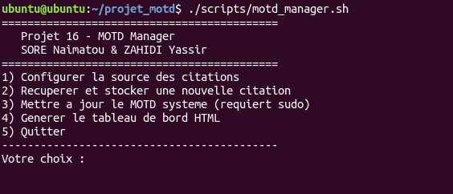
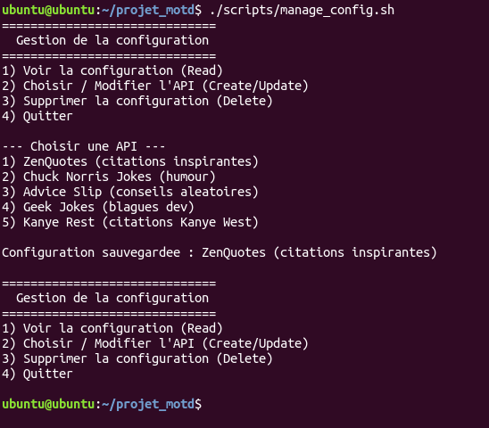
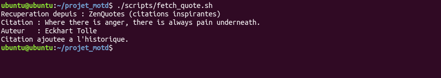
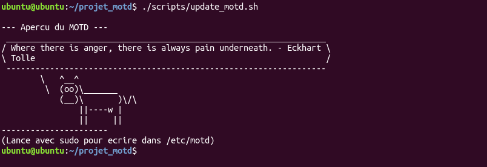

# Linux MOTD Dashboard Showcase

> Bash/Linux project for generating a dynamic Message of the Day from public quote APIs, updating `/etc/motd`, and rendering an HTML dashboard.


This repository is a public showcase for my Linux systems coursework project. It documents the architecture, screenshots, and presentation material while keeping the full Bash source private.

## What this is

The project manages a dynamic Linux MOTD workflow:

- Configure quote API sources.
- Fetch quotes using `curl` and parse responses with `jq`.
- Store quote history as JSON.
- Format and inject the latest quote into `/etc/motd`.
- Generate an HTML dashboard from the quote history.
- Provide a menu-driven terminal interface for the full workflow.

## Workflow

```text
API config
  -> fetch quote
  -> append JSON history
  -> update /etc/motd
  -> generate HTML dashboard
  -> operate from interactive menu
```

## Public Snapshot

| Path | Purpose |
|---|---|
| `screenshots/` | Terminal and dashboard screenshots |
| `code-snippets/motd-flow.sh` | Short illustrative Bash flow |

## Screenshots

| Menu | Configuration |
|:--:|:--:|
|  |  |

| Fetch Quote | Update MOTD |
|:--:|:--:|
|  |  |

| Dashboard |
|:--:|
|  |

## What is private

The complete Bash scripts, templates, generated data, and configuration files are not published here. This repository is intentionally a snapshot, not the full source release.

## Lessons Learned

1. Bash projects need structure. Splitting config, fetch, update, dashboard, and menu logic made the tool easier to reason about.
2. JSON handling in shell should be explicit. `jq` keeps API parsing safer than ad hoc string extraction.
3. System writes need privilege boundaries. MOTD updates behave differently depending on whether the script runs with root permissions.
4. Screenshots matter. A systems project becomes much easier to evaluate when the terminal workflow is visible.

## License

Portfolio snapshot only - see [LICENSE](LICENSE). Full source code remains private.

## About Me

I am **Yassir Zahidi**, a Computer Engineering student focused on cybersecurity, Linux systems, and practical academic projects.

- Portfolio: <https://y-zahidi.github.io>
- GitHub: <https://github.com/y-zahidi>

